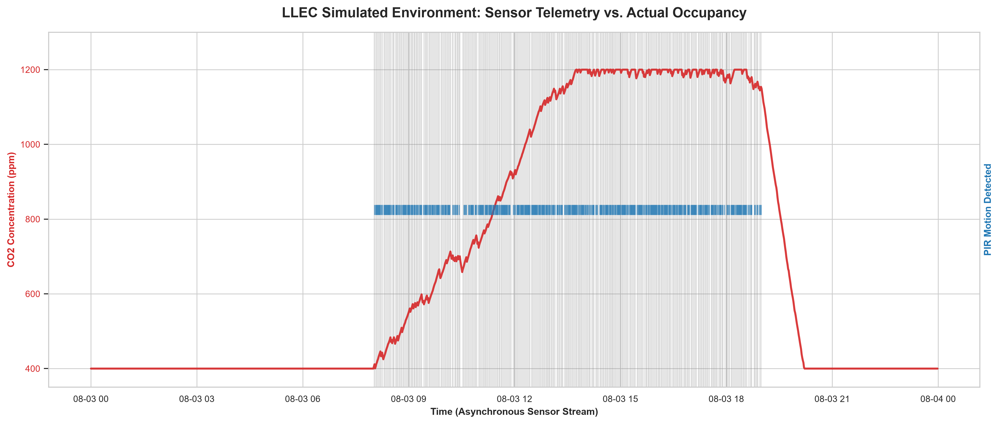

# 🏢 IoT Occupancy Estimator & Sensor Fusion Framework


## 📌 Executive Summary
An enterprise-grade, time-series machine learning framework designed to estimate real-time room occupancy in office buildings using multi-modal IoT sensor telemetry. By fusing asynchronous data streams (PIR motion, $CO_2$ concentration, luminance, and temperature), this framework provides a highly accurate, non-intrusive alternative to direct camera surveillance, directly supporting the intelligent operation of smart HVAC and shading systems.

## 📊 Sensor Fusion Analytics


## ⚙️ System Architecture
The framework is built with strict adherence to reproducibility and scalable data engineering principles:

1. **Telemetry Simulation & Ingestion:** Generates realistic, physically-constrained time-series data mirroring standard office IoT arrays (5-10 devices per room).
2. **Sensor Fusion & Feature Engineering:** Processes raw streams to calculate rolling window averages, delayed response lags, and rates-of-change (RoC) to account for cumulative physical effects (e.g., $CO_2$ dissipation latency).
3. **Estimation Modeling:** Utilizes a Random Forest classification architecture to learn complex, non-linear relationships between environmental noise and actual human occupancy.

## 🚀 Quickstart & Reproducibility

**1. Clone the repository and install dependencies:**
```bash
git clone [https://github.com/thanhan25/iot-occupancy-estimator-framework.git](https://github.com/thanhan25/iot-occupancy-estimator-framework.git)
cd iot-occupancy-estimator-framework
make install
```

**2. Generate Mock Telemetry Data:**
Because physical sensor data is proprietary, this module generates a realistic testing array simulating asynchronous IoT latency.

```bash
make generate
```

**3. Execute the Full Pipeline:**
This triggers the ETL process, engineers time-series features, evaluates the Random Forest model, and serializes the binary weights.

```bash
make run
```

**4. Run the Test Suite:**
Execute the pytest suite to verify ingestion logic and structural integrity.

```bash
make test
```

## 📈 Analytical Methodology
- Asynchronous Integration: Handles the reality that event-based PIR sensors trigger asynchronously compared to continuous-polling PQI meters via Pandas resampling and forward-fill interpolation.

- Algorithm Evaluation: Model hyper-parameters and target variables are completely decoupled via config.yaml to allow for rapid experimental design and A/B testing of different estimation approaches.

## 👤 Author
**An Vo**
M.Sc. Quantitative Economics Candidate | University of Bonn
Bridging rigorous statistical modeling with production-ready data engineering.